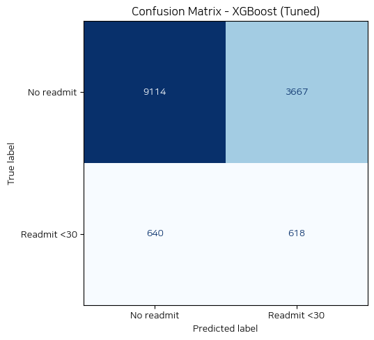
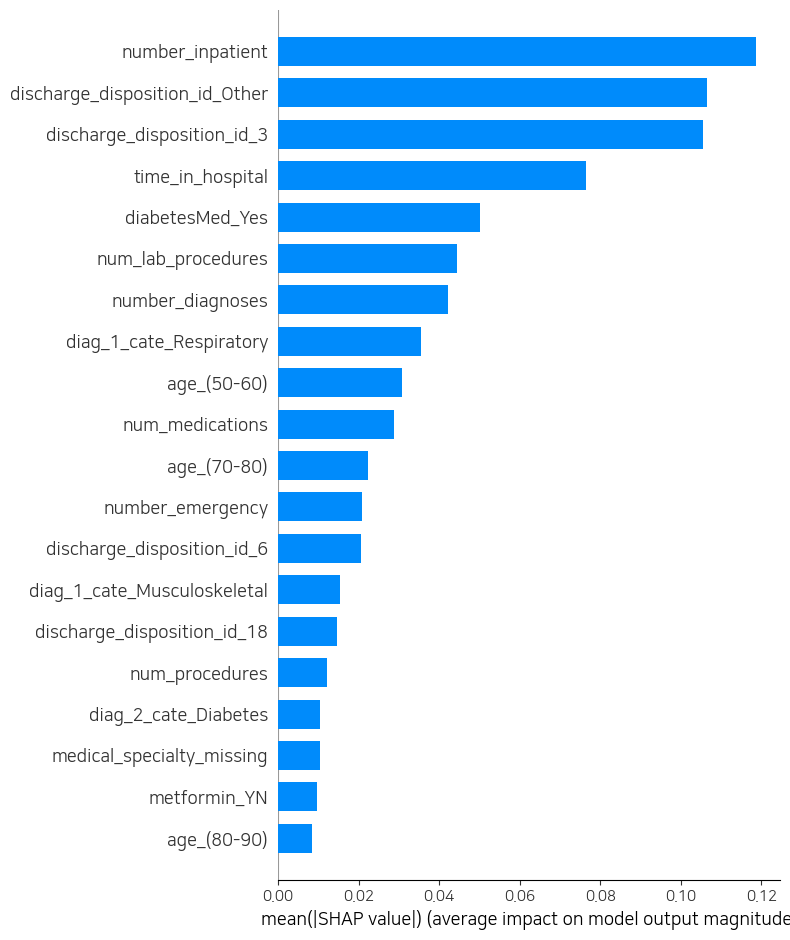
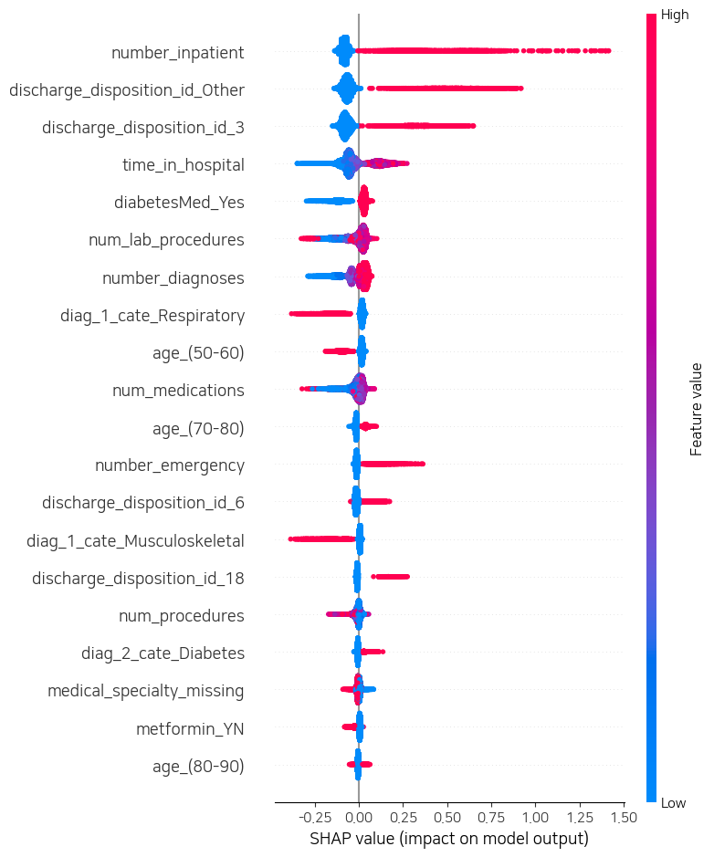
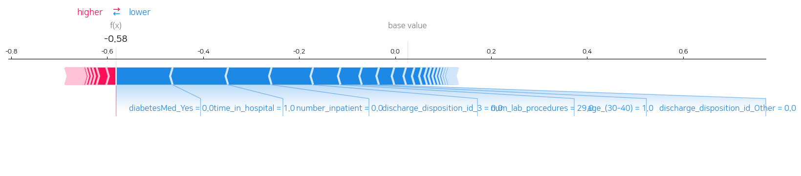
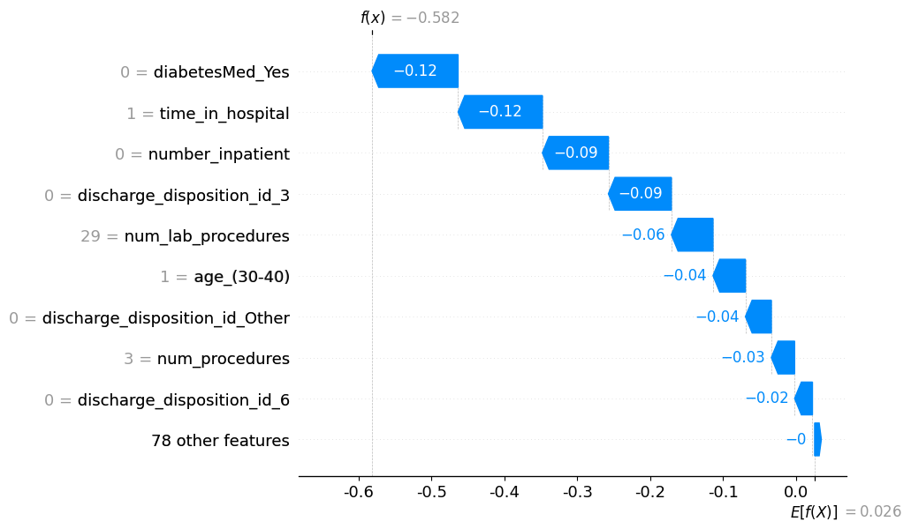

# 당뇨 환자 30일 내 재입원 예측
**Diabetes 30-Day Hospital Readmission Prediction**

> 2014년 SCI 논문(Strack et al.) 재현 후 XGBoost + SHAP으로 성능·해석력 확장

[](https://www.kaggle.com/)
[](https://python.org)
[](LICENSE)

---

## 프로젝트 개요

미국 130개 병원, 1999~2008년 당뇨 환자 입원 기록(10만 건)을 활용하여
**30일 내 재입원 여부를 예측하는 이진 분류 모델**을 개발했습니다.

### 프로젝트 목적
논문을 단순 재현하는 데 그치지 않고, 아래 세 가지를 추가했습니다:

| 구분 | 내용 |
|------|------|
| **모델 비교** | 로지스틱 회귀(해석) vs XGBoost(예측)로 역할을 분리하여 비교 |
| **성능 최적화** | RandomizedSearchCV(n_iter=50, cv=5)로 XGBoost 튜닝 |
| **개별 해석** | SHAP으로 "왜 이 환자가 고위험인가"를 변수 단위로 설명 |

---

## 주요 결과

### 모델 성능

| 모델 | AUC-ROC | Recall | Precision |
|------|---------|--------|-----------|
| 로지스틱 회귀 | 0.637 | 0.54 | 0.13 |
| XGBoost (기본) | 0.639 | 0.50 | 0.14 |
| **XGBoost (튜닝)** | **0.652** | **0.49** | **0.14** |
| 논문 (Strack 2014) | 0.667 | - | - |

> **논문 수준 재현 성공** — XGBoost 튜닝으로 AUC 0.652 달성

### Confusion Matrix (XGBoost 튜닝)



| | 실제: No readmit | 실제: Readmit <30 |
|---|---|---|
| **예측: No readmit** | 9,114 | 640 |
| **예측: Readmit <30** | 3,667 | 618 |

재입원 환자 1,258명 중 618명을 식별했다(Recall 0.49). 다만 재입원으로 예측된
4,285명 중 실제 재입원은 618명뿐이라(Precision 0.14), 나머지 3,667명은
불필요하게 고위험군으로 분류된 것이다. 헬스케어 맥락에서는 재입원 환자를
놓치는 비용이 더 크다고 보고 이 트레이드오프를 감수했다.

### 재입원 예측 주요 요인 (SHAP)

#### 전체 변수 중요도



mean(|SHAP value|) 기준 상위 변수. `number_inpatient`(입원 전 1년간 입원 횟수),
`discharge_disposition_id_Other`/`_3`(요양원·기타 퇴원 형태), `time_in_hospital`이
가장 강한 예측 변수로 나타났다.

#### 방향성 + 크기 (Beeswarm)



빨간 점(변수값 높음)이 오른쪽(재입원 확률 높임)으로 강하게 퍼진 변수일수록
영향력이 크다. `number_inpatient`는 극단값에서 SHAP 값이 1.5까지 나타나
다른 변수와 격차가 크다.

**재입원 확률을 높이는 요인:**
- `number_inpatient` — 입원 전 1년간 입원 횟수 (가장 강한 예측 변수)
- `discharge_disposition_id_Other`, `_3` — 요양원/기타 퇴원 형태
- `time_in_hospital` — 입원 기간
- `diabetesMed_Yes` — 당뇨약 처방 (중증 당뇨 신호)

**재입원 확률을 낮추는 요인:**
- `diag_1_cate_Respiratory` — 호흡기 주진단 (급성 질환, 회복 명확)
- `metformin_YN` — 메트포르민 처방 (체계적 당뇨 관리 신호)

#### 개별 환자 해석 (Force Plot / Waterfall Plot)





특정 환자 1명을 예로 든 해석. base value(전체 평균 재입원 확률)에서 출발해
이 환자는 당뇨약 미처방, 입원 기간 1일, 최근 입원 이력 없음 등의 이유로
최종 예측값이 낮아졌다(f(x) = -0.58). 이런 개별 설명은 임상 담당자가
"왜 이 환자가 고위험/저위험으로 분류됐는지" 납득하는 데 쓰일 수 있다.

---

## 데이터셋

- **출처**: UCI Diabetes 130-US Hospitals Dataset
- **Kaggle**: [brandao/diabetes](https://www.kaggle.com/datasets/brandao/diabetes)
- **원본**: 101,766건 → **전처리 후**: 70,191건
- **타겟**: 30일 내 재입원 여부 (불균형: 재입원 약 9%, 비재입원 약 91%)

---

## 전처리 핵심 결정

### 공통 전처리
```
원본 데이터 (101,766건)
    ↓ 환자당 첫 번째 입원만 사용 (독립성 가정)
    ↓ '?', 'Unknown/Invalid' → 결측 처리
    ↓ 사망/호스피스 케이스 제거 (재입원 불가)
    ↓ 결측 변수 binary 변환 (의료 전문과목, 혈당, HbA1c)
    ↓ ICD-9 코드 → 9개 카테고리 (논문 기준)
    ↓ 약물 처방여부 binary 변환 (_YN)
    ↓ 더미변수화
최종 (70,191건, 약 90개 변수)
```

### 로지스틱 회귀 전처리 (해석 목적)
| 처리 | 대상 | 이유 |
|------|------|------|
| 로그 변환 (log1p) | number_outpatient, number_emergency, number_inpatient, num_medications, time_in_hospital | 극단적 우편향 (왜도 > 1) |
| 파생변수 생성 | lab_per_day = num_lab_procedures / time_in_hospital | 다중공선성 해소 |
| 변수 제거 | num_medications (VIF 29), number_diagnoses (VIF 14.5) | 다중공선성 심각 |
| 희소 변수 제거 | 12개 약물 변수 | 분산 기반 필터링 |
| 표준화 | 수치형 변수만 | binary 변수 의미 보존 |

### XGBoost 전처리 (예측 목적)
- 다중공선성 영향 없음 → 로그 변환·표준화·변수 제거 불필요
- 원본 변수 그대로 사용 (num_medications, number_diagnoses 포함)

---

## 파일 구조

```
diabetes-readmission-prediction/
│
├── diabetes_readmission_prediction.py  # 메인 실행 스크립트
├── notebook.ipynb                       # 분석 전 과정 노트북 (캐글)
├── README.md
└── requirements.txt
```

---

## 실행 방법

### 1. 패키지 설치
```bash
pip install -r requirements.txt
```

### 2. 스크립트 실행
```bash
python diabetes_readmission_prediction.py
```

### 3. 노트북으로 실행 (캐글)
캐글 노트북에서 `notebook.ipynb`를 열어 셀 단위로 실행하면
EDA 시각화와 SHAP 그래프를 포함한 전체 분석 과정을 확인할 수 있습니다.

---

## 요구사항

```
pandas>=1.5.0
numpy>=1.23.0
scikit-learn>=1.1.0
xgboost>=1.7.0
shap>=0.41.0
statsmodels>=0.13.0
matplotlib>=3.5.0
scipy>=1.9.0
kagglehub>=0.1.0
```

---

## 임상적 인사이트

### Recall vs Precision 트레이드오프
| 관점 | 수치 | 임상적 의미 |
|------|------|------------|
| **Recall 0.49** | 재입원 환자 100명 중 49명 식별 | 51명을 놓침 → 환자 예후 악화 위험 |
| **Precision 0.14** | 고위험 예측 100명 중 14명만 실제 재입원 | 86명에게 불필요한 케어 제공 |

> 헬스케어 맥락에서는 **환자를 놓치는 비용 > 불필요한 케어 비용**이므로 Recall을 우선시합니다.

### 한계 및 향후 과제
- 1999~2008년 미국 데이터로 현재 임상 환경과 차이가 있음
- 사회경제적 변수, 복약 순응도, 퇴원 후 케어 정보 부재
- 임계값(threshold) 조정으로 Recall↑ Precision↓ 균형 조정 가능
- 생존분석(Survival Analysis)으로 재입원 **시점** 예측으로 확장 가능

---

## 참고 논문

Strack, B., DeShazo, J. P., Gennings, C., Olmo, J. L., Ventura, S., Cios, K. J., & Clore, J. N. (2014).
**Impact of HbA1c measurement on hospital readmission rates: Analysis of 70,000 clinical database patient records.**
*BioMed Research International*, 2014.

---

## 작성자

**이민식 (Minshik Rhie)**
- GitHub: [@MSRhie](https://github.com/MSRhie)
- Email: stat_12@naver.com
- 응용통계학 석사 | 헬스케어 데이터 분석가
- SCI 공동 제1저자 — Toxics 2023 (IF 4.47)
